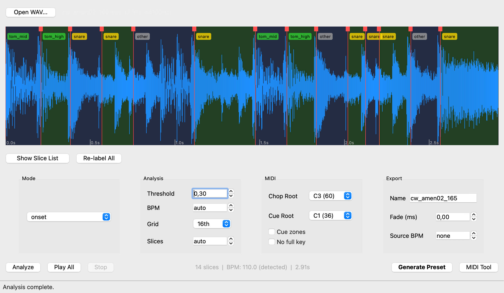

# ChopShop

A sample chopper for GarageBand. Load a breakbeat, slice it into individual hits, and play each one from a keyboard key.



## Why

I wanted to make jungle and drum & bass in GarageBand. The core technique is simple: take a breakbeat loop, chop it into individual drum hits, map each hit to a keyboard key, and rearrange them into new patterns. Every serious DAW makes this easy — Ableton has Simpler, FL Studio has Slicex — but GarageBand's built-in sampler has no slicing workflow at all.

ChopShop fills that gap. It takes an audio loop, slices it up, and generates an `.aupreset` file that GarageBand's AUSampler instrument can load directly. One key per chop, ready to play.

## How It Works

1. **Load** a WAV file (a breakbeat, vocal loop, melodic phrase — anything)
2. **Slice** it — ChopShop detects transients (drum hits) automatically, or you can slice by BPM grid or equal divisions
3. **Adjust** — drag slice markers, add or remove cut points, relabel slices
4. **Generate** — exports individual WAV files for each slice and builds an `.aupreset` file installed directly to GarageBand's preset folder

In GarageBand, create a Software Instrument track, open AUSampler, and load the preset. Each chop is mapped to a key starting at C3.

## What's Solid, What's Rough

**Reliable:**
- Audio slicing (onset detection, grid, and equal modes) — well-tested and accurate
- AUSampler preset generation — correctly builds the XML plist with MIDI zone mapping, file references, and all the undocumented boilerplate that AUSampler needs
- WAV export with optional fade-out and cue zones
- Interactive waveform — click to preview, drag markers to reposition, double-click to add cuts, right-click to remove
- CLI with full control over every parameter

**Experimental:**
- **Auto-labeling** (kick, snare, hat, etc.) — uses spectral heuristics that work as rough suggestions, not ground truth. It's good enough to get you started but will frequently mislabel, especially on busy breaks. You can always click a label to change it.
- **MIDI pattern generator** — generates `.mid` files with drum patterns mapped to your chopped sounds. Functional, but the built-in patterns are limited and the step editor is basic. Think of it as a starting point for getting a beat down quickly, not a production-ready sequencer.

## Getting Started

Requires **Python 3.10+** and **macOS**.

```bash
git clone https://github.com/larswagoner/sample-chopper.git
cd sample-chopper

python3 -m venv .venv
source .venv/bin/activate
pip install -e ".[gui]"
```

Then run:

```bash
chopshop-gui          # main GUI
chopshop my_break.wav # or use the CLI
```

> If your terminal says "command not found", activate the venv first: `source .venv/bin/activate`

## CLI Usage

```bash
# Onset detection (default — finds drum hits automatically)
chopshop my_break.wav

# Grid mode at 170 BPM, 16th notes
chopshop my_break.wav --mode grid --bpm 170 --grid-resolution 16th

# Equal division into 8 slices
chopshop my_break.wav --mode equal --num-slices 8

# Preview slices before generating
chopshop my_break.wav --preview

# Dry run (see what it would do without writing files)
chopshop my_break.wav --dry-run
```

Run `chopshop --help` for the full list of options.

## Example

The [`examples/`](examples/) directory contains a 2.9-second breakbeat loop and the 14 individual chops that ChopShop extracted from it.

## Where Files Go

| What | Location |
|---|---|
| Presets | `~/Library/Audio/Presets/Apple/AUSampler/` |
| Audio slices | `~/Library/Audio/Sounds/ChopShop/<name>/` |
| Chopmaps | `~/Library/Audio/Sounds/ChopShop/<name>/<name>.chopmap.json` |

## Guides

- [GUI Guide](docs/GUI_GUIDE.md) — every control explained
- [MIDI Guide](docs/MIDI_GUIDE.md) — pattern generator walkthrough
- [Jungle Guide](docs/JUNGLE_GUIDE.md) — making 90s jungle in GarageBand with ChopShop

## Development

```bash
pip install -e ".[dev]"
pytest
```

## License

MIT
